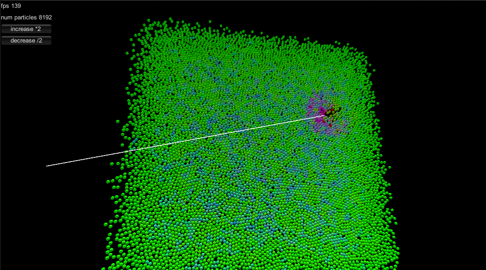

# System requirements
Unity 2021.3.18f1 LTS

# Current state, how it works

-	[Bitonic sort][Bitonic sort Wikipedia] particle index array by hashcode of their position. Hashcode represents index of voxel cell where particle is. 
-	Build array that we can use to find a pair of [count, index start] (to array built in above step) from voxel cell hashcode.
-	Update each particle velocity
	-	Fetch particles from neighbouring 27 voxel cells using hashcode.
	-	Calculate forces from those particles.
	-	Update velocity.
-	Update each particle position.
-	Instanced draw all particles from positions buffer.

Each particle can collide with all other particles, but we leverage the limited interaction radius of particles (the voxel cell edge length corresponds to the maximum interaction radius). So after bitonic sort and hascode, the complexity is only $O(nlog_2(n))$ instead of $O(n^2)$

# What to try next
## Reactive Forcefield FARff
[Prokop Hapala RARFF Solver]
[Prokop Hapala RARFF Solver Test]
## Electron Force Field
[An Electron Force Field for Simulating Large Scale Excited Electron Dynamics]
zkusit implementovat electron-forcefield (eFF) ... ten je uz trochu kvantovy ... a nikdo ho na GPU nema, bylo by to dost cool jako nejaka edukativni hra... ale tam je trochu komplikace:
1) ty elektrony se nafukuji (jsou to jakoby natlakovane oblacky/balonky, cim jsou vetsi tim maji mensi energii)
2) jsou tam silne daleko-dosahove interakce (elekstrostatika), takze ta akcelerace kratko-dosahovych interaci (=kolizi) az tolik nepomuze

# Optimizations
- [Fetch from cells only relevant for particle octant][A More Efficient Parallel Method For Neighbour Search Using CUDA]
- [Botnic sort Leverage group shared memory][Bitonic sort example Unity compute shader]
  
## Other
[Consider using OpenCL in Unity][Using OpenCL in Unity]

# Resources

## Papers
[An Electron Force Field for Simulating Large Scale Excited Electron Dynamics]

[An Electron Force Field for Simulating Large Scale Excited Electron Dynamics]:https://thesis.library.caltech.edu/1598/?fbclid=IwAR2ZoADYZzUbqnOLgEGWrlHrHGmFl805R1VBTvMnfogSYXCDGaHpTaE4fDY

[A More Efficient Parallel Method For Neighbour Search Using CUDA]

[A More Efficient Parallel Method For Neighbour Search Using CUDA]:http://diglib.eg.org/bitstream/handle/10.2312/vriphys20151339/101-109.pdf?fbclid=IwAR26EUM2MlLdBVF2R-NkF0bjqqJYFX8tfkGLBqNXHNTqLG3fWdj0-wn-FoU

## Wikipedia

[Bitonic sort Wikipedia]

[Bitonic sort Wikipedia]:https://en.wikipedia.org/wiki/Bitonic_sorter

## Example/reference code

[Bitonic sort example Unity compute shader]

[Bitonic sort example Unity compute shader]:https://github.com/hiroakioishi/UnityGPUBitonicSort/blob/master/GPUBitonicSort/Assets/BitonicSortCS/BitonicSort.compute

[Using OpenCL in Unity]

[Using OpenCL in Unity]:https://forum.unity.com/threads/opencl-from-unity.720719/

[Prokop Hapala RARFF Solver]

[Prokop Hapala RARFF Solver]:https://github.com/ProkopHapala/SimpleSimulationEngine/blob/master/cpp/common/molecular/RARFF_SR.h

[Prokop Hapala RARFF Solver Test]

[Prokop Hapala RARFF Solver Test]:https://github.com/ProkopHapala/SimpleSimulationEngine/blob/master/cpp/sketches_SDL/Molecular/test_RARFF_SR.cpp