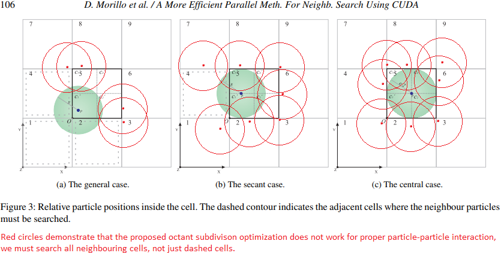

# System requirements
Unity 2021.3.18f1 LTS

# Current state, how it works
-	[Bitonic sort][Bitonic sort Wikipedia] particle index array by hashcode of their position. Hashcode represents index of voxel cell where particle is. 
-	Build array that we can use to find a pair of `[index start, index end]` (to array built in above step) from voxel cell hashcode. [We can build this array by comparing hashcodes of pairs of particles and if they are different we found start and end][NVIDIA Particle Simulation using CUDA, 2010].
-	Update each particle velocity
	-	Fetch particles from neighbouring 27 voxel cells using hashcode.
	-	Calculate forces from those particles.
	-	Update velocity.
-	Update each particle position.
-	Instanced draw all particles from positions buffer.

Each particle can collide with all other particles, but we leverage the limited interaction radius of particles (the voxel cell edge length corresponds to the maximum interaction radius). So after bitonic sort and hascode, the complexity is only $O(nlog_2(n))$ instead of $O(n^2)$

# Relevant algorithms/concepts
## Building the Grid using Sorting 
[NVIDIA Particle Simulation using CUDA, 2010]
> An alternative approach which does not require atomic operations is to use sorting. The algorithm consists of several kernels. The first kernel “calcHash” calculates a hash value for each particle based on its cell id. In this example we simply use the linear cell id as the hash, but it may be beneficial to use other functions such the Z-order curve [8] to improve the coherence of memory accesses. The kernel stores the results to the “particleHash” array in global memory as a uint2 pair (cell hash, particle id). We then sort the particles based on their hash values. The sorting is performed using the fast radix sort provided by the CUDPP library, which uses the algorithm described in [12]. This creates a list of particle ids in cell order. In order for this sorted list to useful, we need to be able to find the start of any given cell in the sorted list. This is achieved by running another kernel “findCellStart”, which uses a thread per particle and compares the cell index of the current particle with the cell index of the previous particle in the sorted list. If the index is different, this indicates the start of a new cell, and the start address is written to another array using a scattered write. The current code also finds the index of the end of each cell in a similar way.

## Bitonic sort
Bitonic sort has $O(nlog_2(n))$ complexity in all cases.

# What to try next
## Electron Force Field
[An Electron Force Field for Simulating Large Scale Excited Electron Dynamics, 2007]
> zkusit implementovat electron-forcefield (eFF) ... ten je uz trochu kvantovy ... a nikdo ho na GPU nema, bylo by to dost cool jako nejaka edukativni hra... ale tam je trochu komplikace:
> 1) ty elektrony se nafukuji (jsou to jakoby natlakovane oblacky/balonky, cim jsou vetsi tim maji mensi energii)
> 2) jsou tam silne daleko-dosahove interakce (elekstrostatika), takze ta akcelerace kratko-dosahovych interaci (=kolizi) az tolik nepomuze

Can optimize using [Fast multipole method](https://en.wikipedia.org/wiki/Fast_multipole_method)

# Optimizations To Do

## Auto tuning
Find best block size
https://forums.developer.nvidia.com/t/how-to-choose-how-many-threads-blocks-to-have/55529/6
Find best hashcode implementation
Find best hash code to particle index array size (probably bigger is better to reduce hashcode collisions) 

## Other
[Consider using OpenCL in Unity][Using OpenCL in Unity]

# Resources

## Papers

[NVIDIA Particle Simulation using CUDA, 2010]

[NVIDIA Particle Simulation using CUDA, 2010]: https://developer.download.nvidia.com/assets/cuda/files/particles.pdf

[Fast 4-way parallel radix sorting on GPUs, 2009]

[Fast 4-way parallel radix sorting on GPUs, 2009]:https://vgc.poly.edu/~csilva/papers/cgf.pdf

[An Electron Force Field for Simulating Large Scale Excited Electron Dynamics, 2007]

[An Electron Force Field for Simulating Large Scale Excited Electron Dynamics, 2007]:https://thesis.library.caltech.edu/1598/?fbclid=IwAR2ZoADYZzUbqnOLgEGWrlHrHGmFl805R1VBTvMnfogSYXCDGaHpTaE4fDY

[Realtime Fluid Simulation on the GPU with Unity3D]

[Realtime Fluid Simulation on the GPU with Unity3D]:https://pats.cs.cf.ac.uk/@archive_file?p=1680&n=final&f=1-report.pdf&SIG=fa08d62b19872176c2660cc5a71a96849e13dd3e1fb3ecbb7561aab23228ee74

[Efficient Spatial Binning on the GPU, AMD Technical Report, 2009]

[Efficient Spatial Binning on the GPU, AMD Technical Report, 2009]:https://www.chrisoat.com/papers/EfficientSpatialBinning.pdf

[A More Efficient Parallel Method For Neighbour Search Using CUDA, 2015]

[A More Efficient Parallel Method For Neighbour Search Using CUDA, 2015]:http://diglib.eg.org/bitstream/handle/10.2312/vriphys20151339/101-109.pdf?fbclid=IwAR26EUM2MlLdBVF2R-NkF0bjqqJYFX8tfkGLBqNXHNTqLG3fWdj0-wn-FoU

## Wikipedia

[Bitonic sort Wikipedia]

[Bitonic sort Wikipedia]:https://en.wikipedia.org/wiki/Bitonic_sorter

## Example/reference code

[Bitonic sort example Unity compute shader]

[Bitonic sort example Unity compute shader]:https://github.com/hiroakioishi/UnityGPUBitonicSort/blob/master/GPUBitonicSort/Assets/BitonicSortCS/BitonicSort.compute

[Using OpenCL in Unity]

[Using OpenCL in Unity]:https://forum.unity.com/threads/opencl-from-unity.720719/

[Prokop Hapala RARFF Solver]

[Prokop Hapala RARFF Solver]:https://github.com/ProkopHapala/SimpleSimulationEngine/blob/master/cpp/common/molecular/RARFF_SR.h

[Prokop Hapala RARFF Solver Test]

[Prokop Hapala RARFF Solver Test]:https://github.com/ProkopHapala/SimpleSimulationEngine/blob/master/cpp/sketches_SDL/Molecular/test_RARFF_SR.cpp

[GPU Radix Sort]

[GPU Radix Sort]:https://github.com/mark-poscablo/gpu-radix-sort